  <a href="https://github.com/ehurafa">
 <!--  
   --></a>
  

  Sou Desenvolvedor Front-end Sênior com mais de 15 anos de experiência, atuando na construção de produtos digitais escaláveis, performáticos e orientados à experiência do usuário. Ao longo da minha trajetória, contribuí para bancos, fintechs, e-commerces e grandes marcas, para criar experiências incríveis.
    
Trabalho com arquitetura front-end, Design Systems, micro-frontends e aplicações SSR/CSR em contextos de alta complexidade, como plataformas financeiras, e-commerce e produtos B2B. Ao longo da carreira, apoiei times a reduzir retrabalho, padronizar código e melhorar métricas de performance, SEO e Web Vitals.

Tenho forte atuação em otimização de performance, acessibilidade, testes automatizados e observabilidade, colaborando de perto com design, produto e engenharia para entregar soluções consistentes, sustentáveis e alinhadas aos objetivos do negócio.

Acredito que minha missão como Desenvolvedor é resolver problemas!

  

  

    <!--  -->

   <b>Meus commits nos últimos 6 meses</b>

  

 
   
  
  
  
  
  
  
 
  
  
  
  
  
  
    

 

 

