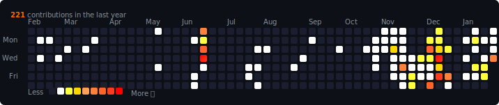

# 🔥 GitHub Contribution Heatmap Personalizado

Heatmap de contribuições do GitHub com cores customizadas do branco ao vermelho com fogo!

## 🎨 Cores

- 🤍 **Nível 1** (1-2 commits): Branco
- 💛 **Nível 2** (3-4 commits): Amarelo vibrante
- 🏆 **Nível 3** (5 commits): Dourado
- 🟠 **Nível 4** (6 commits): Laranja claro
- 🧡 **Nível 5** (7 commits): Laranja
- 🔶 **Nível 6** (8 commits): Laranja avermelhado
- 🔴 **Nível 7** (9 commits): Vermelho alaranjado
- 🔥 **Nível 8** (10+ commits): **VERMELHO COM FOGO!**

## 📋 Como Usar

### Opção 1: Setup Manual (Mais simples)

1. **Clone este repositório**
```bash
git clone https://github.com/SEU_USERNAME/SEU_USERNAME.git
cd SEU_USERNAME
```

2. **Crie um token do GitHub**
   - Vá em: https://github.com/settings/tokens
   - Clique em "Generate new token (classic)"
   - Dê permissão: `read:user`
   - Copie o token gerado

3. **Configure o ambiente (.env)**
   - Renomeie `.env.example` para `.env`
   - Adicione seus dados:
   ```ini
   GITHUB_USERNAME=seu_usuario
   GITHUB_TOKEN=seu_token_aqui
   ```

4. **Instale dependências**
```bash
pip install requests python-dotenv
```

5. **Gere o heatmap**
```bash
python generate_heatmap_v2.py
```

6. **Adicione ao seu README**
```markdown

```

### Opção 2: Automático com GitHub Actions (Recomendado)

1. **Crie o repositório especial**
   - Nome: igual ao seu username (ex: `ehurafa`)
   - Visibilidade: Público
   - Adicione os arquivos:
     - `generate_heatmap.py`
     - `.github/workflows/update-heatmap.yml`
     - `README.md`

2. **Configure o GitHub Token**
   - O workflow já usa `${{ secrets.GITHUB_TOKEN }}` automaticamente
   - Não precisa configurar nada!

3. **Ative o workflow**
   - Vá em "Actions" no seu repositório
   - Clique em "I understand my workflows, go ahead and enable them"

4. **Atualizações automáticas**
   - Roda todo dia às 00:00 UTC
   - Ou execute manualmente em "Actions" > "Update GitHub Heatmap" > "Run workflow"

## 🚀 Estrutura dos Arquivos

```
ehurafa/                           # Repositório com seu username
├── .github/
│   └── workflows/
│       └── update-heatmap.yml    # GitHub Action para atualização automática
├── generate_heatmap.py           # Script que gera o SVG
├── github-heatmap.svg            # SVG gerado (atualizado automaticamente)
└── README.md                     # Seu README com o heatmap
```

## 📝 Exemplo de README.md

```markdown
# Olá! 👋 Eu sou o Rafael

## 🔥 Minhas Contribuições


## 📊 Estatísticas

- 🚀 Desenvolvedor Full Stack
- 💻 Apaixonado por tecnologia
- 🔥 Contribuindo todos os dias!
```

## 🔧 Customização

Para mudar as cores, edite o dicionário `COLORS` no arquivo `generate_heatmap.py`:

```python
COLORS = {
    0: "#1a1e2e",           # Sem commits
    1: "rgb(255,255,255)",  # 1-2 commits
    2: "#ffff3e",           # 3-4 commits
    # ... suas cores aqui
}
```

## 🐛 Troubleshooting

**Erro de autenticação?**
- Verifique se o token tem a permissão `read:user`
- Certifique-se de que o token está no formato correto: `ghp_...`

**Heatmap não atualiza?**
- Verifique os logs em "Actions" no seu repositório
- Confirme que o workflow está ativado

**SVG não aparece no perfil?**
- Certifique-se de que o arquivo está commitado
- O caminho no README está correto: `./github-heatmap.svg`
- O repositório está público

## 📄 Licença

MIT - Sinta-se livre para usar e modificar!

---

⭐ Se você gostou, dê uma estrela no repositório!
